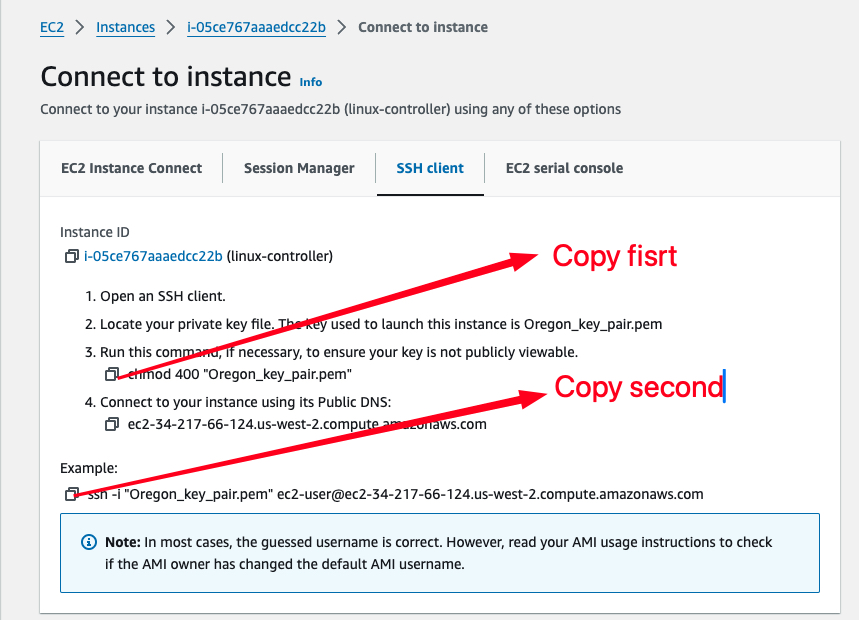

# Ansible Configuration on AWS using Terraform


## 🚀 Overview:
In modern cloud environments, managing infrastructure efficiently and securely is crucial for ensuring smooth operations and maximizing resource utilization. Ansible, a powerful automation tool, provides a flexible and scalable solution for configuration management, provisioning, and orchestration of infrastructure on AWS. By leveraging Ansible, organizations can streamline deployment processes, enforce consistent configurations, and accelerate time-to-market for their applications. The primary objective of this project is to design and deploy a controller Linux server, two Linux client servers and two Ubuntu client server on AWS. Then we will be writing a playbook that will be installing and configuring apache on all clients servers. The playbook will include also git installation.  


## 🔧 Problem Statement

Terraform is an IaC software tool that provides a consistent command line interface (CLI) workflow to manage hundreds of cloud services. Terraform codifies cloud APIs into declarative configuration files. In this specific case you need to create 5 EC2 instances such as 1 Amazon Linux 2 that will call controller, then two clients or nodes with Amazon Linux 2 and 2 other with Ubuntu. Terraform will automatically use the configuration files to provide those resources and the user data placed in te controller will install Ansible on it. We will then use the Ansible playbook to update all hosts, install Apache and Git then copy te index.html file on each hosts. This deployment will provide all neccessary tools and needed elements avoiding us to use the console. All process of working on nodes will be automate that will ensuring consistency and reducing human error.

## 💽 Techonology Stack

We will be using: 

- **EC2**: AWS EC2

- **Ansible Playbook**: Ansible

- **File Configuration**: Terraform

## 📌 Architecture Diagram


## 🌟 Project Requirements

Before you get started, make sure you have the following prerequisites in place:

- [Terraform](https://www.terraform.io/) installed on your local machine.
- AWS IAM credentials configured in your text editor. In this case we will use VSCODE.
- Git installed on your local machine and Github account set up [Github](https://www.github.com)
- Git for cloning the repository.

You must know and understand:

- **ansible playbook**: is a YAML file that defines a series of tasks to be executed on remote hosts. 
- **Apache web Server**: 
The Apache HTTP Server, commonly referred to as Apache, is an open-source web server software developed and maintained by the Apache Software Foundation. It is one of the most widely used web server applications globally and powers a significant portion of websites on the internet.
- **Git**: is a distributed version control system (VCS) that is widely used for tracking changes in source code during software development.

You must also know Terraform workflow


## 📋 Table of Contents

I - Terraform Configuration files
  
  [Step 1: Provider Configuration](#-Provider-configuration)

  [Step 2: Variables Configuration](#-variables-configuration)

  [Step 3: Instances Configuration](#-VPC-configuration)

  [Step 4: Output Configuration](#-Output-configuration)

II - Instructions of Deployment

  [Step 1: Clone Repository](#-Clone-Repository)

  [Step 2: Initialize Folder](#-Initialize-Folder)

  [Step 3: Format Files](#-Format-Files)

  [Step 4: Validate Files](#-Validate-Files)

  [Step 5: Plan](#-Plan)

  [Step 6: Apply](#-Apply)

  [Step 7: Review of Resources](#-Review-Of-Resources)

  [Step 8: Connect to the Controller](#-Connect-To-The-Controller)

  [Step 9: Connect to all Hosts](#-Connect-To-All-Hosts)

  [Step 10: Generate & Copy Key Pair](#-Generate-Copy-Key-Pair)

  [Step 11: Configuration on Controller](#-Configuration-On-Controller)

  [Step 12: Run Ansible Command](#-Run-Ansible-Command)

  [Step 13: Review of Changes](#-Review-Of-Changes)

  [Step 14: Destroy](#-Destroy)

## ✨Terraform Configuration files 

You need to write different files generating resources

##### Step 1:  ***Provider Configuration***

Here we declare our cloud provider and we specify the region where we will be launching resources

- [provider Configuration](https://github.com/Joebaho/Joebaho-Cloud-Platform/blob/main/site/ansible-terraform-on-aws/providers.tf)

##### Step 2:  ***Variables Configuration***

This is where we declare all variables and thier value. It includes

- **Variables**: List of element that can vary or change. They can be reuse values throughout our code without repeating ourselves and help make the code dynamic
- **values**: values attributed to each variables.


Reminder: Never push terraform.tfvars file on Github

We have 

- [variables Configuration](https://github.com/Joebaho/Joebaho-Cloud-Platform/blob/main/site/ansible-terraform-on-aws/variables.tf)
- [value Configuration](https://github.com/Joebaho/Joebaho-Cloud-Platform/blob/main/site/ansible-terraform-on-aws/terraform.tfvars)


##### Step 3: ***Instances Configuration***

This is where you create all fives instances. The controller and two other nodes will be running on Aamazon linux 2 and two other on Ubuntu. We will open port 80 (http) and 22 (ssh) on the security group.  

- [Instances Configuration](https://github.com/Joebaho/Joebaho-Cloud-Platform/blob/main/site/ansible-terraform-on-aws/main.tf)


##### Step 4: ***Output Configuration***

Know as Output Value : it is a convenient way to get useful information about your infranstructure printed on the CLI. It is showing the ARN, name or ID of a resource. In this case we are bringing out the DNS name of the web application Load balancer.  

- [Output Configuration](https://github.com/Joebaho/Joebaho-Cloud-Platform/blob/main/site/ansible-terraform-on-aws/outputs.tf)

## 💼 Instructions of Deployment

Follow these steps to deploy the architecture:

##### Step 1: ***Clone Repository***

Clone the repository in your local machine using the command "git clone" 

```bash
   git clone https://github.com/Joebaho/Joebaho-Cloud-Platform/blob/main/site/ansible-terraform-on-aws
```

##### Step 2: ***Initialize Folder***

Initialize the folder containing configuation files that were clone to Terraform and apply the configuration by typing  the following command
  
```bash
   terraform init
```

   You must see this image

   

##### Step 3: ***Format Files***

Apply any changes on files and Review the changes and confirm the good format with command:
   
```bash
   terraform fmt
```
   
##### Step 4: ***Validate Files***

Ensure that every files are syntactically valid and ready to go with the command: 
   
```bash
   terraform validate
```

   If everything is good you will have something like this 

   

##### Step 5: ***Plan***

Create an excution plan to provide the achievement of the desired state. It Check and confirm the numbers of resources that will be create. Use command:
   
```bash
   terraform plan
```
   
   The list of all resources in stage of creation will appear and you can see all properties(arguments and attributs) of each resouces

    

    

##### Step 6: ***Apply***

Bring all desired state resources on life. It Launch and create all resources listed in the configuration files. The command to perform the task is:  
   
```bash
   terraform apply -auto-approve
```

tAfter typing this command the process of creation will start and you will be able to see which resourse is on the way to be create and the time it taking to create.

     

At the end you will recieve a prompt message showing all resources status: created, changed and the numbers of them. 

     

##### Step 7: ***Review of resources***

Go back on the console and check all actual state resources one by one to see. You will have

 
Instances running

    

Security groups

    


##### Step 8: ***Connect to the Controller***

As we have our security group rule open on port SSH(22) we gonna use the CLI to connect to the controller instance. We must be on the folder that contains our private key pair. Then we go on the console select the instance hit on connect. you will have an image like the bellow: 

    

Copy the Chmod command and paste on the CLI then type enter. Nothing will change. This command just chane the permission for SSH. 

Copy the link second link and paste again CLI. Some instructions will run and you will be prompt to validate if you want to connect : type "yes" and you will have an image like bellow showing the conection to the server is been made. 

    

The user date placed in the configuration file will install preresquistises needed to run ansiblie such as Python3, amazon-linux extras and Ansible. take a look on the user data.

- [user Data](https://github.com/Joebaho/Joebaho-Cloud-Platform/blob/main/site/ansible-terraform-on-aws/user_data.sh)

We can now change the static name or IP address to the name " controller " with the command 

```bash
   $ sudo hostnamectl set-hostname controller
```
After you must exit and reconnect (ssh) again in order to have the new name appear in the path. 

We now need to go on root to perform other command. We can do that with the command

```bash
   $ sudo -i
```
We can verify if Ansible was correctly install by typing command: 

```bash
   $ ansible --version
```
There we will have this result

 


##### Step 9: ***Connect to all Hosts***

We also, going to use the same process we used to connect to the controller meaning we will be SSH on each server. 

Go to each server on the console select one by one and connect via option connect. In the tab Copy the Chmod command and paste on the CLI then type enter. Nothing will change. this command just chane the permission for SSH. 

Copy the link second link and paste again CLI. Some instructions will run and you will be prompt to validate if you want to connect : type "yes" the process will now connect to the server. Linux2 and Ubuntu. You going to use the command bellow to change name for each server 

```bash
   $ sudo hostnamectl set-hostname <name of the server>
```  
For the Amazon Linux type : Linux-nodes1 and Linux-nodes2.<br> 
For Ubuntu type : ubuntu-nodes1 and ubuntu-nodes2.<br>
Remember to exit and reconnect agagin to have the command take effect. Right after you must go to the root of the server by typing command 

```bash
   $ sudo -i
```   

At the end you will have an image with all servers CLI like bellow showing the conection to the server is been made. 

  


##### Step 10: ***Generate & Copy Key Pair***

Return to the controller to generate key pair that will be use to link  the host server and clients or nodes server. We will generate a key pair which have a public and private key. You will have to copy the public and paste it in the folder named authorizerd_key of each nodes.

-Generate key pair with the command: must be on the root to perform this 

```bash
   $ ssh-keygen -t rsa
```   

Keep typing enter after all question asked. The command will generate public key (id_rsa.pub) and private key (id_rsa).  Both will be in the folder name ".ssh" Enter the folder to see both keys. Type

```bash        
   $ cd .ssh 
```
Then the next command will list the contains of the folder

```bash
   $ ls -al
``` 
See the resultt on the image bellow

  

-The private key will stay in the controller and the public key will be copy and paste in the nodes.

```bash
   $ cat id_rsa.pub
``` 

Copy the content and go paste it in the authorized_keys of the nodes. You will have to go to each nodes be on the root and then enter the folder ".SSH " by typing command
 
```bash      
   $ cd .ssh 
```
You can list what is the contain of the folder with command

```bash
   $ ls -al 
```
You will have a file name authorized_keys. You will have to enter the file by: 

```bash        
   $ vi authorized_keys
```

The file will have the private key already.  So, you will have to type I (insert) then " fn +     right arrow " to go to the end, then enter to go down and paste the copied text there. Lastly type Esc + :wq! To save the change. Do the same for all your nodes. 

Here are images for all steps: 

  

  

  


##### Step 11: ***Configuration on Controller***

You can now return to the controller and follow the configuration of the nodes by copy and paste the nodes Ip address in order to create the link between controller and nodes. 
Make sure to be in the ".SSH " folder then from there type version command

```bash
   $ ansible --version
``` 
There will be a config file with destination /etc/ansible/ansible.cfg. You must enter in the ansible folder 

```bash
   $ cd /etc/
```
Then

```bash
   $ cd ansible
```
And this command to see the content of the folder.

```bash
   $ ls -al
```                            
There will be three files (ansilbe.cfg, hosts and roles). You must enter the files hosts to add  all hosts meaning all private IP of all the nodes in the Ex2 collection section. If you group make sure to put the name of the group in brackets [ubuntu-nodes] and [linux-nodes] and down the public or private IP address of the nodes.

  

Enter the hosts file to perform all changes:

```bash
   $ vi hosts
```
Type i (insert) then copy/paste all IP address of nodes in the IP section of the file, Lastly type Esc  : wq! To save the change.

You must create a folder on the root named " web " and you must drop the "index.html" inside the folder. 

##### Step 12: ***Run Ansible Command***

To test the connectivity you can try with one nodes or all nodes 
One nodes type 
```bash  
   $ ssh root@<private Ip placed on the hosts lists>.                   Ex: $ ssh root@10.0.1.10
```

You will be prompt to valid the connection so you will press "y" to confirm and the connection will go through. To logout type exit.

For all servers type:

```bash
   $ ansible -m ping all                                  If you want to ping all hosts
``` 
```bash
   $ ansible -m ping group-name.                          If you want to ping a specific group
```
```bash
   $ ansible -m ping ip                                   if you want to ping just one address 
```

  

##### Step 13: ***Review of Changes***

After making sure all connectivies are done between the controller and nodes. We have to return to the root and create a folder named "web" with the command 

```bash
   $ mkdir web
```
then enter the folder with the command

```bash
   $ cd web
```

Once you inside the folder you must create two files " index.html " and " playbook.yml "

- [index.html](https://github.com/Joebaho/Joebaho-Cloud-Platform/blob/main/site/ansible-terraform-on-aws/index.html)

- [playbook.yml](https://github.com/Joebaho/Joebaho-Cloud-Platform/blob/main/site/ansible-terraform-on-aws/playbook.yml)

As we have both files setup in the web folder. We will remain on the folder and we will use the ansble command to perform all the requiments of the playbook file. Type command;

```bash
   $ ansible-playbook playbook.yml
```

the process will follow and you will have all the steps or plays written in the playbook been deploy. images will show waht exactly are the outputs 

  

  

  

 You can test the web page by copying any public Ip of nodes then paste it in the browser you will have this bellow result.

  


##### Step 14: ***Destroy***

Destroy the terraform managed infrastructure meaning all resourcescreated will be shut down. This action can be done with the command "terraform destroy" 
   
```bash
   terraform destroy -auto-approve
```
   

At the end you will recieve a prompt message showing all resources has been destroyed

     

## 🤝 Contributing

Your perspective is valuable! Whether you see potential for improvement or appreciate what's already here, your contributions are welcomed and appreciated. Thank you for considering joining us in making this project even better. Feel free to follow me for updates on this project and others, and to explore opportunities for collaboration. Together, we can create something amazing!


## 📄 License

This project is licensed under the Joebahocloud License