# AWS VPC FlowLogs

## 🚀 Overview:
The project aims to leverage VPC flow logs, a feature provided by Amazon Web Services (AWS), to enhance network visibility, security monitoring, and troubleshooting capabilities within the AWS environment. By enabling and analyzing VPC flow logs, the project seeks to provide valuable insights into network traffic patterns, detect security threats and anomalies, and optimize network performance. By implementing a robust VPC flow logs solution and integrating it into existing network monitoring and security frameworks, organizations can enhance their ability to manage and secure their AWS environments effectively, mitigating risks, improving operational efficiency, and ensuring compliance with regulatory requirements.

## 🔧 Problem Statement

In complex cloud environments hosted on AWS, maintaining comprehensive visibility into network traffic and ensuring robust security monitoring are critical challenges for organizations. Traditional network monitoring tools may not provide sufficient visibility into traffic flows within virtual private clouds (VPCs), making it difficult to detect and investigate security incidents, troubleshoot connectivity issues, and optimize network performance.To address these challenges, the project proposes leveraging VPC flow logs, a feature provided by AWS, to capture and analyze network traffic metadata at the VPC level. VPC flow logs provide detailed information about the traffic flowing to and from network interfaces in the VPC, including source and destination IP addresses, ports, protocols, and packet counts.

## 💽 Techonology Stack

 The architecture consists of the following three tiers:

- **VPC**: AWS VPC

- **IAM role**: AWS IAM

- **EC2 Instances**: AWS EC2

- **CloudWatch**: AWS Cloudwatch

- **VPC Flowlogs**: AWS VPC flow logs

## 📌 Architecture Diagram

## 🌟 Project Requirements

Before you get started, make sure you have the following prerequisites in place:

- AWS IAM credentials configured in your text editor. In this case we will use VSCODE.
- Git installed on your local machine and Github account set up [Github](https://www.github.com)
- Git for cloning the repository.
- An Infrastructure (VPC, Subnets, route table, Security groups, NCAL...) ready to be use for the lab.
- Two instances running with a user data attached on each.

You must also know the goal of setting up a VPC flow logs which are: 

1- **Enhanced Network Visibility**: Gain comprehensive visibility into network traffic patterns and behavior within the AWS VPC environment. 
2- **Improved Security Monitoring**: Detect and investigate security threats, anomalies, and unauthorized access attempts in real-time. 
3- **Efficient Troubleshooting**: Quickly diagnose and troubleshoot connectivity issues, performance bottlenecks, and network anomalies. 
4- **Optimized Network Performance**: Identify opportunities to optimize network performance, resource utilization, and cost efficiency based on traffic analysis and insights. 

## 📋 Table of Contents

I - **Infrastructure Configuration** 
  
  [Step 1: VPC Configuration](#-VPC-Configuration)

  [Step 2: Instances Configuration](#-intances-configuration)

  [Step 3: Web page Output ](#-web-page-output)

II - **Instructions of Deployment**

  [Step 1: IAM Role](#-IAM-Role-Creation)

  [Step 2: Log Group creation](#-Log-Group-Creation)

  [Step 3: FlowLogs Creation](#-Flow-Logs_creation)

  [Step 4: Checking Logs](#-Checking-Logs)

  [Step 5: Understanding Logs](#-Understanding-Logs)

## ✨Infrastructure Configuration 

You need to create all resources needed for the accomplishment of the project. We considere this part easy to do. So, we will present infrastructure that was prebuild

##### Step 1:  **VPC Configuration**

Here we declare our foundation or networking environment. We have here vpc, subnets, routable, securitys groups, NCAL...

 - VPC 

 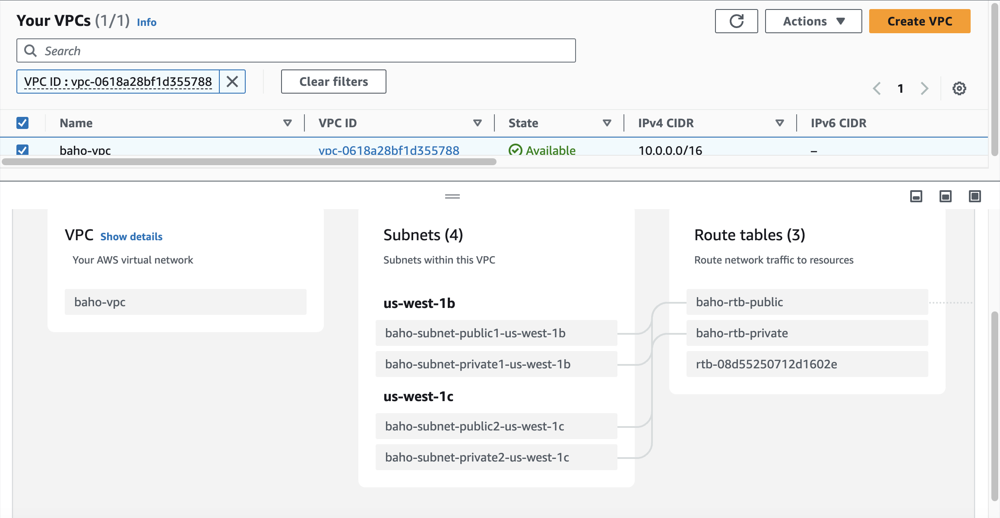

##### Step 2: **Instances Configuration**  

 - EC2 instances

 We will be launching two EC2 intances in the public subnets with user data attached on them. We will use the public Ip address to display the content on the browser. 

 [User-data](https://github.com/Joebaho/Joebaho-Cloud-Platform/blob/main/site/vpc-flow-logs-on-aws/userdata.sh) 

 Instance 1

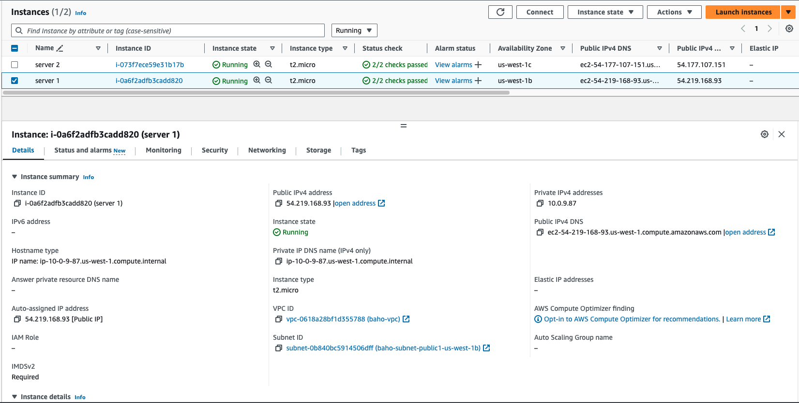

Instance 2

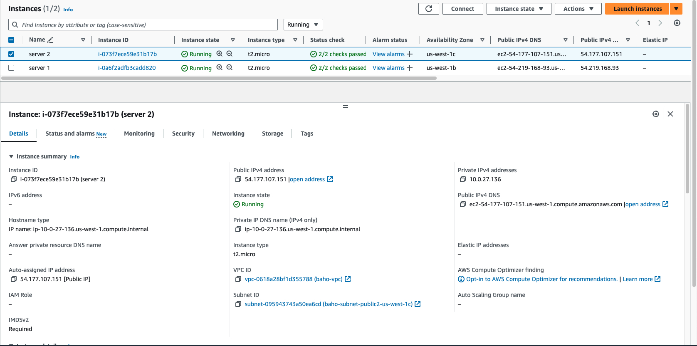

##### Step 3: **Web page output**

 We will use public IP address of each instances to see the web page on the browser. These are the two web pages showing the message posted in the user data. 

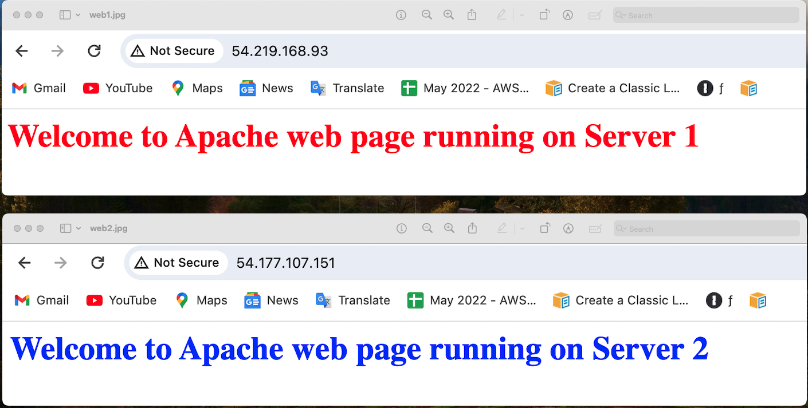

## 💼 Instructions of Deployment  

Follow these steps to produce the VPC flowlogs:  

##### Step 1: **Create the IAM role**  

Create an IAM role that will allow the VPC to drop all logs in Cloudwatch. The full access  permission need to be add in the role and the trusted entite in the role must be edit to "vpc-flow-logs.amazonaws.com" 

Create role by giving name and a description 

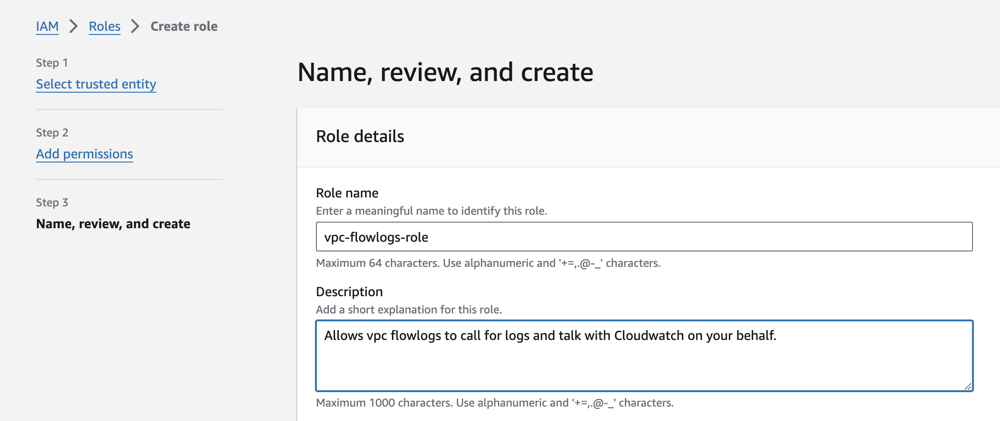

Add the Cloudwatch full access permission

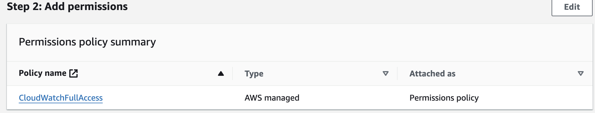

In the "Trust Relationship " you must change the trust policy by replacing the trusted entite **"ec2.amazonaws.com"** to **"vpc-flow-logs.amazonaws.com"**

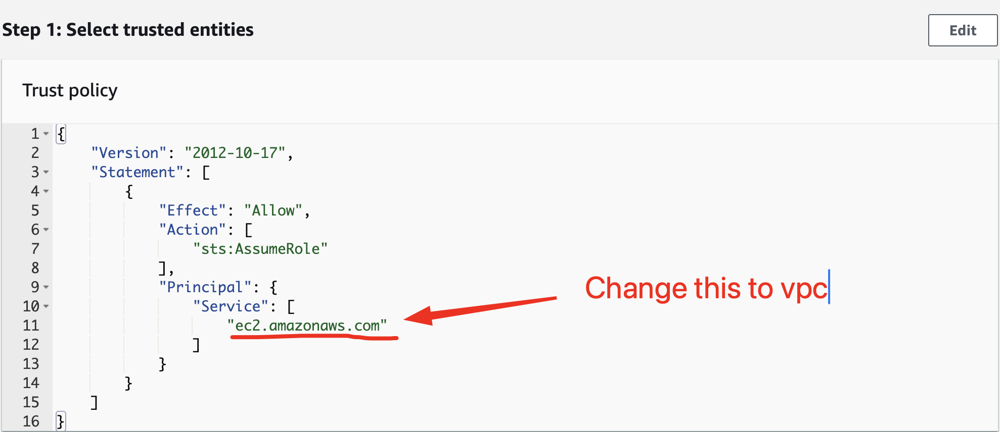

You have to follow this way : **Trust relationship / click Edit trust policy / "vpc-flow-logs.amazonaws.com"** 

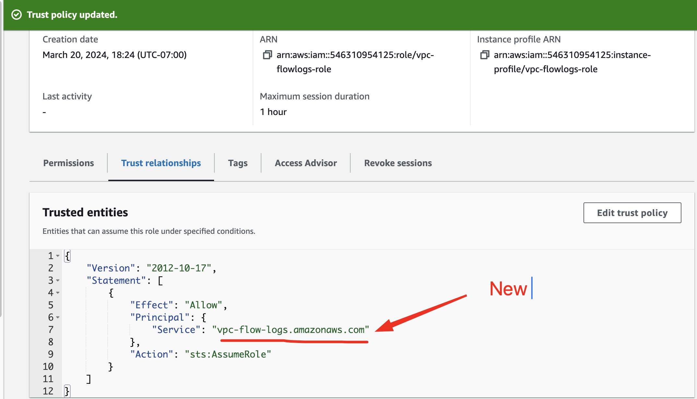

##### Step 2: **Create the Log Group in the Cloudwatch**

Go on Cloudwatch to create the log group by following the way:  

**CloudWatch > Log groups > Click Create log group**  

You will have to provide

 - **Name of the log group** 
 - **Retention period** : giving the period of time when the logs can be kept
 - **Class** : type of the log group.

 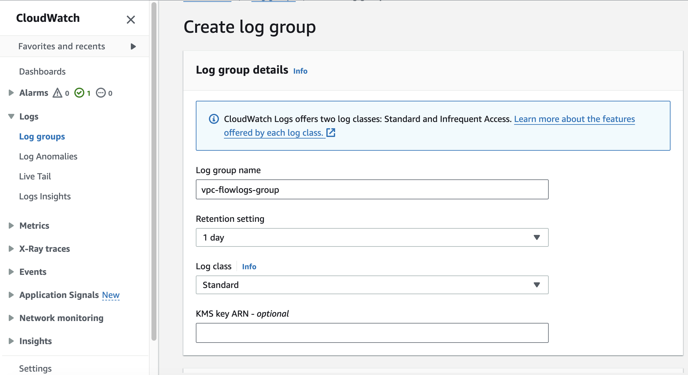

##### Step 3: **Create Flowlogs in VCP**

You must go back on your VPC option, select the VPC you working then keep following the process  

**VPC > select your_vpc > click Flow Logs tab > click Create flow logs**

In the flow log tab open you will add differents setting such as:  

 - **Name**: identifier of the flowlogs 
 - **filter** : type of the traffic to be considered. It will be Accepted, Reject or both
 - **Maximun aggregation interval**: the interval of time  where the flowlogs will capture record. 

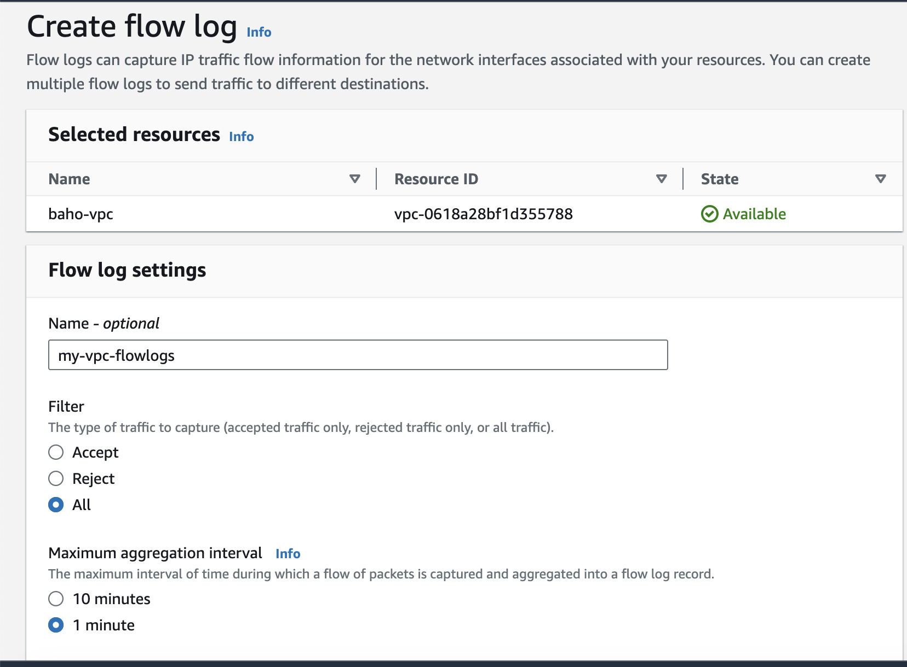

A destination where the logs will be dump must be specify.There are multiple place as you can see in the picture.  In our case we gonna drop them in Cloudwatch logs. The role created before is also need to be attached after.  

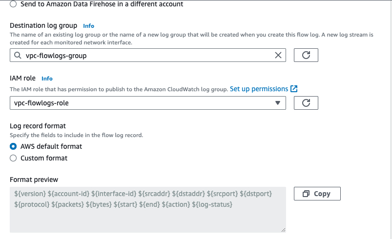

At the end we have declare the format of the ouptput of the logs. Either we can customize it oe use the AWS default format 

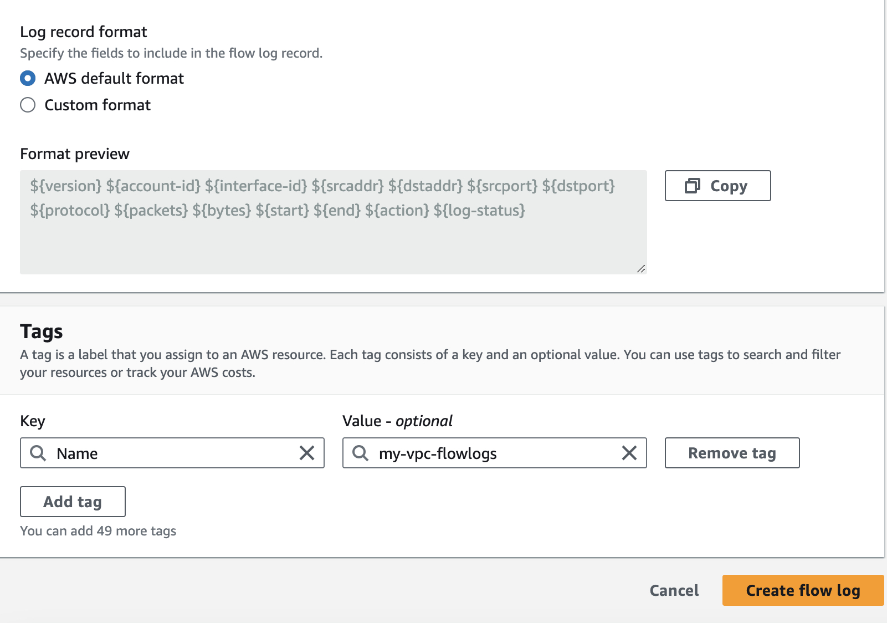

   
##### Step 4: **Check the logs**

Here comes the time to see the result of the VPC flowlogs. Remember we launched two EC2 instances. Each instances have an ENI(Elastic Network Interface) which is a virtual network interface that you can attach to an instance in a VPC (Virtual Private Cloud) in AWS. ENIs enable instances to communicate with other resources in the VPC and with the internet. In order to see the flow of access accepted or rejected to the instances we must go back on Cloudwatch then follow the process

**Cloudwatch > Log groups > Choose the log group(vpc-flowlogs-group) >Log streams Tabs > Choose eni** 

A picture like the bellow one will appear 

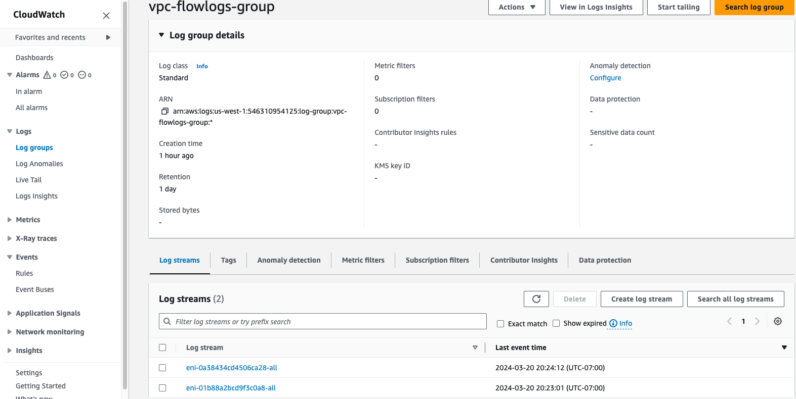

As you pick the firt eni here come the flowlogs of the specific eni. 

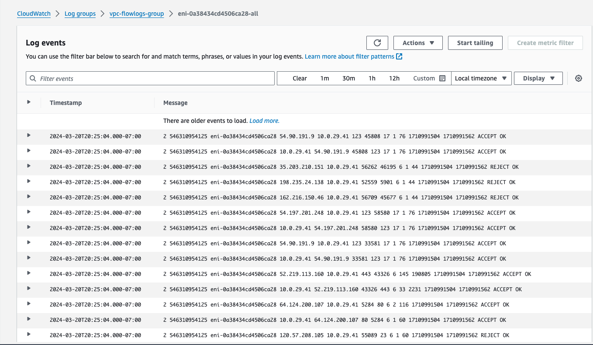

Then the second eni will produce the logs bellow

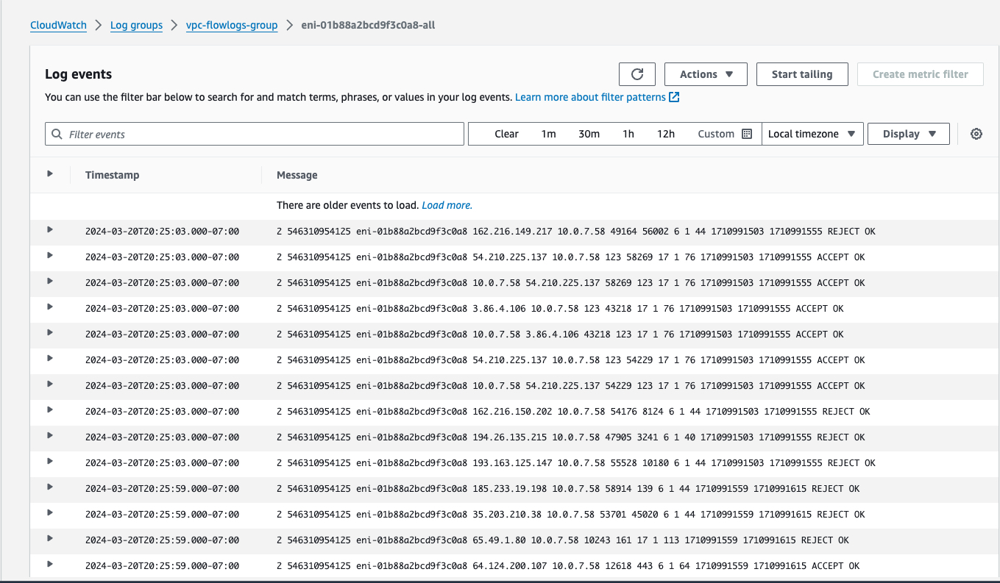

#### Step 5: **Understand the logs**

Understanding VPC Flow Logs is essential for monitoring and analyzing network traffic within your AWS Virtual Private Cloud (VPC). VPC Flow Logs capture information about the traffic flowing in and out of network interfaces in your VPC, providing valuable insights into network activity, including the source and destination of traffic, the protocols used, and the number of packets and bytes transferred.

Here's how you can interpret and understand VPC Flow Logs:

*1-Log Format:*

VPC Flow Logs are stored in CloudWatch Logs and can be viewed in the AWS Management Console. Each log record contains information about a specific network flow, including fields such as source and destination IP addresses, ports, protocol, action (accepted or rejected), and timestamps.
Understanding Fields:

*2-Understanding Fields*

**Source/Destination IP Address**: The source and destination IP addresses of the network traffic. 
**Source/Destination Port**: The source and destination ports used in the network communication. 
**Protocol**: The protocol used in the network communication (e.g., TCP, UDP, ICMP). 
**Packets/Bytes**: The number of packets and bytes transferred in the network flow. 
**Action**: Indicates whether the traffic was accepted or rejected by security groups or network ACLs. 
**Timestamp**: The timestamp when the network flow occurred. 

*3- Traffic Patterns:*

Analyze traffic patterns to identify trends and anomalies. Look for patterns such as spikes in traffic volume, unusual source/destination IP addresses, or unexpected protocols. This can help detect security threats, performance issues, or misconfigurations.

*4- Security Analysis:*

Use VPC Flow Logs for security analysis and monitoring. Identify and investigate suspicious or unauthorized network activity, such as unauthorized access attempts, port scans, or data exfiltration attempts. VPC Flow Logs can help you detect and respond to security incidents in real-time.

*5- Troubleshooting:*

Troubleshoot network connectivity issues by analyzing VPC Flow Logs. Identify failed connections, dropped packets, or misconfigured security group rules that may be causing connectivity problems. VPC Flow Logs provide valuable diagnostic information to help pinpoint the root cause of network issues.

*6- Compliance and Auditing:*

Use VPC Flow Logs for compliance and auditing purposes. Maintain records of network traffic for regulatory compliance requirements or internal auditing purposes. VPC Flow Logs provide a detailed audit trail of network activity within your VPC.

*7- Integration with Other Tools:*

Integrate VPC Flow Logs with other AWS services or third-party tools for advanced analysis and visualization. For example, you can use Amazon Athena or Amazon Elasticsearch Service to perform ad-hoc queries and visualize network traffic data for deeper insights.

Take a look an exampleof output 

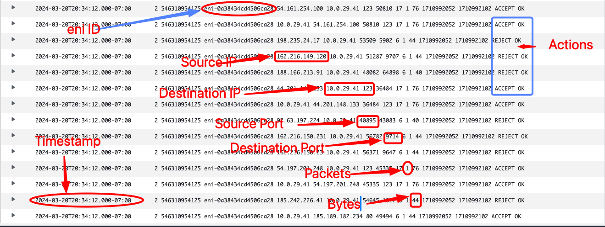

By understanding and analyzing VPC Flow Logs, you can gain valuable visibility into your AWS VPC's network traffic, enhance security monitoring, troubleshoot network issues, and ensure compliance with regulatory requirements.

## 📄 License

This project is licensed under the Joebaho Cloud License