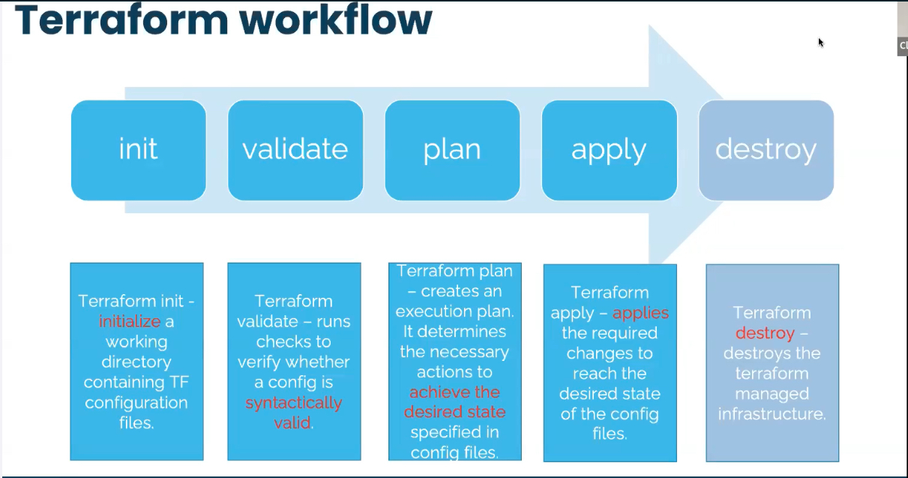

# Virtual Private Cloud Architecture on AWS using Terraform

## 🚀 Overview:
The VPC Architecture project on AWS using Terraform aims to create a scalable and resilient infrastructure that leverages the power of Amazon Web Services (AWS) cloud platform. This project utilizes Terraform, an Infrastructure as Code (IaC) tool, to provision and manage the infrastructure components, enabling automation, repeatability, and scalability. The primary objective of this project is to design and deploy a virtual Private Cloud or Networking architecture on AWS that consists of multiple compoments, including basement, networking, traffic flow. All compoments will be deployed across two Availability Zones (AZs) for high availability and fault tolerance.

## 🔧 Problem Statement

Terraform is an IaC software tool that provides a consistent command line interface (CLI) workflow to manage hundreds of cloud services. Terraform codifies cloud APIs into declarative configuration files. In this specific case you need to create foundation Networking(VPC, Subnets, route table, IGW, NAT Gateway...), Terraform will automatically use the configuration files to provide the infrastructure resources where we can  run application needed. Terraform will use his deployment to provide all AWS needed elements avoiding us to use the console and it will automate the setup, ensuring consistency and reducing human error.

## 💽 Techonology Stack

 The architecture consists of the following three tiers:

- **VPC**: AWS VPC

- **Subnets**: AWS Subnets

- **Route table**: AWS route table

- **NACL**: AWS NACL

- **Internet Gateway**: AWS IGW

## 📌 Architecture Diagram

.png)

## 🌟 Project Requirements

Before you get started, make sure you have the following prerequisites in place:

- [Terraform](https://www.terraform.io/) installed on your local machine.
- AWS IAM credentials configured in your text editor. In this case we will use VSCODE.
- Git installed on your local machine and Github account set up [Github](https://www.github.com)
- Git for cloning the repository.

You must also know Terraform workflow

## 📋 Table of Contents

I - **Terraform Configuration files**
  
  [Step 1: Provider Configuration](#-Provider-configuration)

  [Step 2: Variables Configuration](#-variables-configuration)

  [Step 3: VPC Configuration](#-VPC-configuration)

  [Step 4: Output Configuration](#-Output-configuration)

II - **Instructions of Deployment**

  [Step 5: Clone Repository](#-Clone-Repository)

  [Step 6: Initialize Folder](#-Initialize-Folder)

  [Step 7: Format Files](#-Format-Files)

  [Step 8: Validate Files](#-Validate-Files)

  [Step 9: Plan](#-Plan)

  [Step 10: Apply](#-Apply)

  [Step 11: Review of Resources](#-Review-Of-Resources)

  [Step 12: Destroy](#-Destroy) 
  
 

## ✨Terraform Configuration files 

 
You need to write different files generating resources
 

##### Step 1:  ***Provider Configuration***

Here we declare our cloud provider and we specify the region where we will be launching resources

- [provider Configuration](https://github.com/Joebaho/Joebaho-Cloud-Platform/blob/main/site/vpc-foundation-terraform-on-aws/providers.tf)

##### Step 2:  ***Variables Configuration***

This is where we declare all variables and thier value. It includes

- **Variables**: List of element that can vary or change. They can be reuse values throughout our code without repeating ourselves and help make the code dynamic
- **values**: values attributed to each variables.

We have 

- [variables Configuration](https://github.com/Joebaho/Joebaho-Cloud-Platform/blob/main/site/vpc-foundation-terraform-on-aws/variables.tf)
- [value Configuration](https://github.com/Joebaho/Joebaho-Cloud-Platform/blob/main/site/vpc-foundation-terraform-on-aws/terraform.tfvars)

##### Step 3: ***VPC Configuration***

This is where you create the basement, foundation and networking where all the resources will be launch. It includes VPC, Subnets, IGW, NatGateway, EIP and Route tables

- [VPC Configuration](https://github.com/Joebaho/Joebaho-Cloud-Platform/blob/main/site/vpc-foundation-terraform-on-aws/main.tf)

We have here

- **Web Servers**: These run your application code that contains the apache which will deploy the index.html located in the user data.
- **Load Balancer**: Distributes traffic across multiple web servers running in the public subnets.
- **Auto Scaling**: Automatically adjusts the number of web servers based on traffic.
- **Security Groups**: Controls incoming and outgoing traffic from outside to the web servers.

##### Step 4: ***Output Configuration***

Know as Output Value : it is a convenient way to get useful information about your infranstructure printed on the CLI. It is showing the ARN, name or ID of a resource. In this case we are bringing out the DNS name of the web application Load balancer.  

- [Output Configuration](https://github.com/Joebaho/Joebaho-Cloud-Platform/blob/main/site/vpc-foundation-terraform-on-aws/outputs.tf)

## 💼 Instructions of Deployment
 
Follow these steps to deploy the architecture:
 

##### Step 5: ***Clone Repository:***

 
Clone the repository in your local machine using the command "git clone" 
 
>
   git clone https://github.com/Joebaho/Joebaho-Cloud-Platform/tree/main/site/vpc-foundation-terraform-on-aws
   
 
##### Step 6: ***Initialize Folder***

 
Initialize the folder containing configuation files that were clone to Terraform and apply the configuration by typing  the following command
   
>
   terraform init
   
 
   You must see this image

   

##### Step 7: ***Format Files***
 
Apply any changes on files and Review the changes and confirm the good format with command:
   
>
   terraform fmt

    
##### Step 8: ***Validate Files***

 
Ensure that every files are syntactically valid and ready to go with the command: 
   
>
   terraform validate

   If everything is good you will have something like this 

   

##### Step 9: ***Plan***
 
Create an excution plan to provide the achievement of the desired state. It Check and confirm the numbers of resources that will be create. Use command:
   
>
   terraform plan

   
   The list of all resources in stage of creation will appear and you can see all properties(arguments and attributs) of each resouces

    

    

##### Step 10: ***Apply***

 
Bring all desired state resources on life. It Launch and create all resources listed in the configuration files. The command to perform the task is:  
   
>
   terraform apply -auto-approve

You will be prompt to type the username and password for the database. After you enter those criticals data the process of creation will start and you will be able to see which resourse is on the way to be create and the time it taking to create.

At the end you will recieve a prompt message showing all resources status: created, changed and the numbers of them. 

     

##### Step 11: ***Review of resources***

 
Go back on the console and check all actual state resources one by one to see. You will have

  
- **VPC**

    

   
- **Subnets**

    

   
- **IGW**

    

   
- **Route Tables**

    

  
- **NCAL**

    

##### Step 12: ***Destroy***  

 
Destroy the terraform managed infrastructure meaning all resourcescreated will be shut down. This action can be done with the command "terraform destroy" 
   
 >  
   terraform destroy -auto-approve
   
   

At the end you will recieve a prompt message showing all resources has been destroyed

     

## 📄 License

This project is licensed under the Joebaho Cloud License